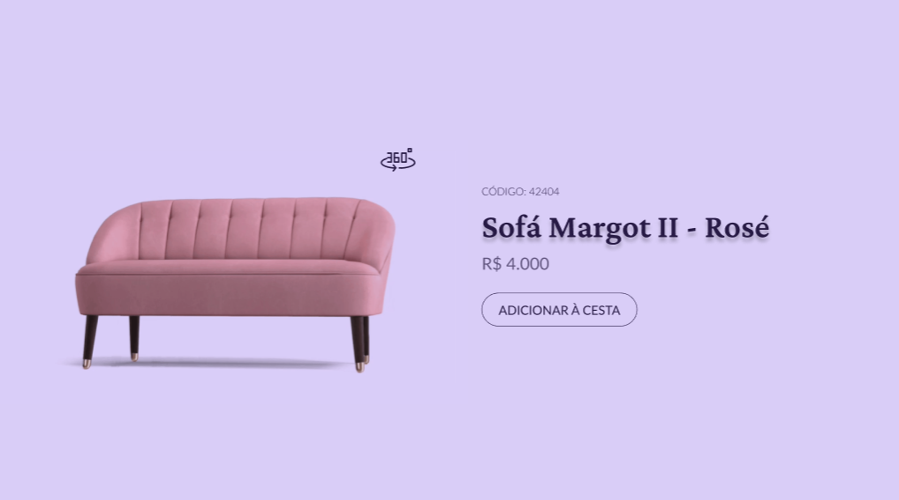

  <a href="#-tecnologias">Tecnologias</a>&nbsp;&nbsp;&nbsp;|&nbsp;&nbsp;&nbsp;
  <a href="#-desafio">Desafio</a>&nbsp;&nbsp;&nbsp;|&nbsp;&nbsp;&nbsp;
  <a href="#-layout">Layout</a>

 

  

## 🚀 Tecnologias

Esse projeto foi desenvolvido com as seguintes tecnologias:

- HTML
- JavaScript
- TailwindCSS

## 💻 Desafio

Esse é o desafio 2, de uma série de desafios que a RocketSeat, está postando semanalmente atráves [desse link](https://boracodar.dev), onde eles liberam um design do Figma e o deseenvolvedor escolhe a forma que prefere codar.

## 🔖 Layout

Você pode visualizar o layout do projeto através [desse link](https://www.figma.com/community/file/1195050984449538256). É necessário ter conta no [Figma](https://figma.com) para acessá-lo.

Feito com ♥ by Renan and Rocketseat
